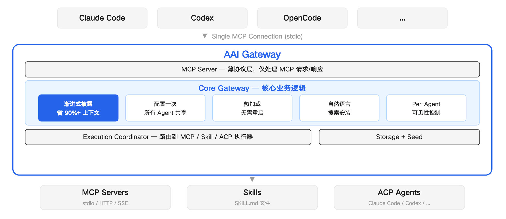

[English](README.md) | [简体中文](README.zh-CN.md) | [日本語](README.ja.md) | 한국어

---

# AAI Gateway: MCP 도구와 Skill 통합 관리, AI Agent 간 공유, 컨텍스트 토큰 99% 절감

[](https://www.npmjs.com/package/aai-gateway)
[](./LICENSE)

---

## 무엇인가요

**AAI** = **Agent App Interface**

AAI Gateway는 Agent App의 인터랙션 게이트웨이입니다.

**Agent App**이란? Agent App은 Agent가 사용할 수 있는 기능의 집합입니다. 예를 들어:

- **MCP Server**는 하나의 Agent App — 도구 세트를 제공
- **Skill 패키지**도 하나의 Agent App — 하나 이상의 스킬을 제공

AAI Gateway에서는 이들을 **Agent App**으로 통합 관리합니다. 한 번 가져오면 모든 AI Agent에서 즉시 사용 가능합니다.

---

## 어떤 문제를 해결하나요

### 컨텍스트 팽창

기존 방식: 10개 MCP × 5개 도구 = **50개 전체 schema ≈ 7,500 토큰**, 매 대화마다 주입.

AAI Gateway: 각 Agent App은 **50 토큰 미만의 요약**만 필요하고, 상세 정보는 필요할 때 로드. **토큰 99% 절감.**

### 도구 찾기 어려움

기존 방식: GitHub 검색 → README 읽기 → JSON 설정 복사 → 연결 디버깅 → Agent 재시작.

AAI Gateway: **Agent에게 "AAI로 xxx 검색해줘"라고 말하면 — 자동 검색, 설치, 즉시 사용 가능**.

> "AAI로 브라우저 조작 도구 검색해줘"
>
> → 검색 → Playwright MCP 발견 → Agent가 한 줄 Agent App 요약 작성 → 설치 → 즉시 사용 가능, 재시작 불필요

> "AAI로 PPT 제작 스킬 검색해줘"
>
> → 검색 → PPT Skill 발견 → 스킬 설명을 Agent App 요약으로 사용 → 설치 → 즉시 사용 가능, 재시작 불필요

### 중복 설정

Claude Code, Codex, OpenCode에 각각 설정? AAI Gateway로 한 번 가져오면 모든 Agent가 즉시 공유.

---

## 빠른 시작 (30초)

**Claude Code:**

```bash
claude mcp add --scope user --transport stdio aai-gateway -- npx -y aai-gateway
```

**Codex:**

```bash
codex mcp add aai-gateway -- npx -y aai-gateway
```

**OpenCode** — `~/.config/opencode/opencode.json`에 추가:

```json
{
  "mcp": {
    "aai-gateway": {
      "type": "local",
      "command": ["npx", "-y", "aai-gateway"],
      "enabled": true
    }
  }
}
```

설치 후, Agent에게 하고 싶은 것을 말하면 됩니다.

---

## 내장 도구

| 도구 | 설명 |
|------|------|
| `search:discover` | 자연어로 새 도구 검색 및 설치 |
| `mcp:import` | MCP Server를 Agent App으로 가져오기 |
| `skill:import` | Skill 패키지를 Agent App으로 가져오기 |
| `listAllAaiApps` | 등록된 모든 Agent App 목록 |
| `enableApp` / `disableApp` | Agent별로 Agent App 활성화/비활성화 |
| `removeApp` | Agent App 제거 |
| `aai:exec` | Agent App 내 특정 도구 실행 |

가져온 각 Agent App은 **`app_<app-id>`** 도구를 생성하며, 호출 시 전체 운영 가이드와 도구 목록을 반환합니다.

### 프리셋 Agent App (로컬에 설치된 경우에만 자동 검색)

| App ID | 이름 | 설명 |
|--------|------|------|
| `claude` | Claude Code | AI 코딩 어시스턴트, 코드 편집·분석·개발 |
| `codex` | Codex | OpenAI 기반 AI 코딩 어시스턴트 |
| `opencode` | OpenCode | AI 개발 어시스턴트, 파일 편집·명령 실행 |

---

## 아키텍처



---

## 개발자: Agent App을 자동 검색 가능하게 하기

`aai.json` 설명 파일을 작성하여 `src/discovery/descriptors/`에 제출하세요. 사용자의 로컬 환경이 `discovery.checks` 조건을 충족하면 Agent가 자동으로 당신의 Agent App을 검색합니다.

```json
{
  "schemaVersion": "2.0",
  "version": "1.0.0",
  "app": {
    "name": { "default": "My App", "ko": "내 앱" }
  },
  "discovery": {
    "checks": [
      { "kind": "command", "command": "my-app" }
    ]
  },
  "access": {
    "protocol": "mcp",
    "config": {
      "command": "my-app-mcp",
      "args": ["--stdio"]
    }
  },
  "exposure": {
    "summary": "사용자가 X를 하고 싶을 때 사용."
  }
}
```

`discovery.checks`는 세 가지 검사 유형 지원: `command`(명령어 존재), `file`(파일 존재), `path`(디렉터리 존재).

지원 프로토콜: `mcp`, `skill`, `acp-agent`

새로운 Agent App 설명 파일 [PR 제출](../../pulls) 또는 [Issue 열기](../../issues)로 피드백을 보내주세요.
