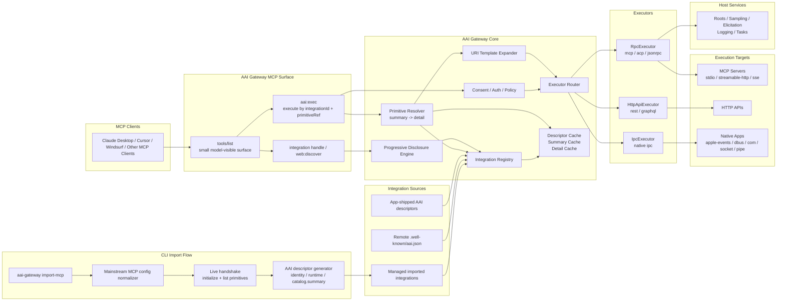

# AAI 设计

本文档描述了 AAI 描述符结构和执行器架构的设计方案。该设计假设这是一个全新项目，无兼容性约束，目标是支持绝大多数现有 MCP 服务器，同时覆盖原生 IPC 应用和传统 HTTP API。

## 实现状态

本文档描述的重写方案已成为当前活跃的项目结构。

- 模型可见面被有意限定为 `integration:<id>` 句柄加上 `aai:exec`。
- 渐进式披露通过注册表、披露引擎和原语解析器在网关代码中强制执行。
- `import-mcp` 已内置到 CLI 中，支持直接的 stdio 导入、远程 MCP URL 导入以及主流 `mcpServers` 配置格式的标准化。
- `RpcExecutor` 支持 MCP 风格运行时的 `stdio`、`streamable-http` 和 `sse` 传输。
- `HttpApiExecutor` 支持 `http` 和 `graphql` 工具绑定。
- `IpcExecutor` 提供了 `unix-socket` 和 `named-pipe` 传输的通用套接字/管道引用路径。平台特定的适配器（如 `apple-events`、`dbus` 和 `com`）作为同一执行器契约下的传输驱动程序，而非独立的网关概念。
- 资源模板采用延迟执行，在调用时展开 URI 模板变量，然后通过 `resources/read` 解析。

## 设计目标

AAI 不应只是一个静态工具列表。它应是一个足够小、但又足够实用的集成描述符。

协议本身只需要回答几件事：

- 这个集成是谁
- 它大致从哪里来
- gateway 应该如何连接它
- 它大概提供哪些能力
- 如果需要认证，宿主应如何理解认证输入

而以下问题不应继续堆进协议字段中：

- 渐进式披露策略细节
- 发现刷新策略
- 宿主治理和风控细节
- 运行时握手得到的能力结果
- 缓存、同步和执行优化策略

这些都应由 `aai-gateway` 在代码和运行时中按约定处理。

## 作者侧简化原则

描述符不应该把全部运行时复杂度直接暴露给 app 所有者。

协议层面应只有一套正式的 `aai.json` schema。

这套 schema 应尽量小、尽量基于约定、尽量降低填写成本。

核心分工：

- app 作者负责描述“它是什么、怎么连接、提供什么能力”
- gateway 负责在代码里按约定补默认值、做推导、做握手探测、做缓存和策略控制

因此，不应该把所有高级配置都开放给作者侧填写，也不应该把“作者侧 schema / 内部 schema”设计成两个正式协议层。

## 单层协议与运行时派生

建议方向：

- `aai.json` 对外只保留一套正式协议结构
- gateway 在解析和运行时按约定计算派生值
- 这些派生值属于代码逻辑和运行时状态，不属于第二套协议 schema

推荐由 gateway 在代码中自动补齐或推导的内容包括：

- 根据 `runtime.type` 推导内部执行器路由
- 根据 `summary` / `snapshot` 推导运行时加载方式
- 根据握手结果获取运行时能力
- 对大规模集成默认启用渐进式披露
- 将大部分 `audit`、`trust`、`consent`、`limits` 控制收敛到 gateway 全局策略

这样可以同时降低：

- app 作者的描述文件复杂度
- `aai-gateway` 的实现和维护复杂度
- 文档理解成本

## AAI Structure Overview

```ts
type JsonObject = Record<string, unknown>;
type JsonSchemaObject = Record<string, unknown>;

interface AaiJson {
  schemaVersion: '2.0';
  identity: Identity;
  source?: Source;
  runtime: Runtime;
  catalog?: Catalog;
  auth?: AuthProfile;
  _meta?: JsonObject;
}

interface Identity {
  id: string;
  name: string;
  title?: string;
  description?: string;
  version?: string;
  websiteUrl?: string;
  icons?: Icon[];
  aliases?: string[];
}

interface Source {
  kind: 'local' | 'remote' | 'imported';
  url?: string;
  filePath?: string;
  note?: string;
}

interface Runtime {
  type: 'mcp-stdio' | 'mcp-http' | 'mcp-sse' | 'http' | 'ipc';
  command?: string;
  args?: string[];
  cwd?: string;
  env?: Record<string, string>;
  url?: string;
  headers?: HeaderField[];
  baseUrl?: string;
  target?: string;
  _meta?: JsonObject;
}

interface InputField {
  name: string;
  title?: string;
  description?: string;
  isRequired?: boolean;
  isSecret?: boolean;
  default?: string | number | boolean;
  choices?: Array<string | number | boolean>;
}

interface HeaderField extends InputField {}

interface AuthProfile {
  type:
    | 'none'
    | 'env'
    | 'header'
    | 'oauth2'
    | 'basic'
    | 'cookie'
    | 'custom';
  instructions?: string;
  inputs?: InputField[];
  oauth2?: {
    issuerUrl?: string;
    authorizationServerUrl?: string;
    authorizationEndpoint?: string;
    tokenEndpoint?: string;
    scopes?: string[];
    audience?: string;
    pkce?: boolean;
  };
}

interface Catalog {
  tools?: CatalogSection<ToolDef>;
  prompts?: CatalogSection<PromptDef>;
  resources?: CatalogSection<ResourceDef>;
  resourceTemplates?: CatalogSection<ResourceTemplateDef>;
}

interface CatalogSection<T> {
  summary?: PrimitiveSummary[];
  snapshot?: T[];
}

interface PrimitiveSummary {
  ref: string;
  kind: 'tool' | 'prompt' | 'resource' | 'resource-template';
  name: string;
  title?: string;
  description?: string;
}

interface ToolDef {
  ref: string;
  name: string;
  title?: string;
  description?: string;
  icons?: Icon[];
  inputSchema: JsonSchemaObject;
  outputSchema?: JsonSchemaObject;
  binding?: ToolBinding;
  _meta?: JsonObject;
}

type ToolBinding =
  | { type: 'mcp-tool'; toolName?: string }
  | { type: 'http'; path: string; method: string; headers?: Record<string, string> }
  | { type: 'graphql'; document: string; operationName?: string }
  | { type: 'ipc'; operation: string };

interface PromptDef {
  ref: string;
  name: string;
  title?: string;
  description?: string;
  icons?: Icon[];
  arguments?: PromptArgument[];
  _meta?: JsonObject;
}

interface PromptArgument {
  name: string;
  title?: string;
  description?: string;
  required?: boolean;
}

interface ResourceDef {
  ref: string;
  name: string;
  title?: string;
  uri: string;
  description?: string;
  mimeType?: string;
  icons?: Icon[];
  size?: number;
  _meta?: JsonObject;
}

interface ResourceTemplateDef {
  ref: string;
  name: string;
  title?: string;
  uriTemplate: string;
  description?: string;
  mimeType?: string;
  icons?: Icon[];
  _meta?: JsonObject;
}

interface Icon {
  src: string;
  mimeType?: string;
  sizes?: string[];
  theme?: 'light' | 'dark';
}
```

## Target Architecture

The following diagram reflects the target architecture after the AAI rewrite and the built-in MCP import flow are both in place.



## 用户操作流程

网关应为已安装的应用保持低摩擦的体验，同时也能扩展到大规模的远程 MCP 生态系统。

### 流程 1：已安装的本地应用

对于已安装在用户计算机上的应用：

1. 网关在启动或刷新时扫描本地应用描述符或平台特定的发现元数据。
2. 新发现的本地应用默认标记为 `enabled = true`，因为安装本身已表达使用意图。
3. 已启用的本地应用直接暴露在 `tools/list` 中。
4. 用户随后可以通过网关配置界面禁用任何本地应用，而无需卸载应用本身。

设计规则：

- 本地已安装应用应是一等公民集成
- 它们不应在首次使用前需要额外的"激活"步骤
- 它们仍必须可以被用户禁用

### 流程 2：已知远程应用

对于知名的远程应用或网站：

1. 用户提供产品名称，如 `Notion`、`GitHub` 或 `Linear`。
2. 网关通过解析管道解析该名称，而非强迫模型猜测域名。
3. 如果找到高可信度的远程描述符或服务器卡片，网关会获取、验证并写入托管缓存条目。
4. 一旦缓存并启用，远程应用就会像其他集成一样出现在 `tools/list` 中。

解析优先级：

1. 本地名称到域名缓存
2. 内置精选名称/别名映射
3. 注册表查询
4. 服务器卡片查询
5. 用户显式提供的 URL

设计规则：

- 模型便捷性可使用名称
- 网关权威必须来自缓存、注册表、服务器卡片或显式用户输入
- 不应以自由形式的模型猜测未知域名作为主要机制

### 流程 3：未知或私有远程应用

对于未知网站、内部工具或私有 MCP 服务器：

1. 用户提供具体的 `domain`、`base URL`、`descriptor URL` 或 MCP 端点。
2. 网关获取或探测远程目标。
3. 成功后，网关将解析后的描述符身份、来源 URL、别名和信任元数据存储在本地缓存中。
4. 该集成随后成为正常的已启用托管集成，出现在 `tools/list` 中。

设计规则：

- 对于未知远程应用，需要显式的 URL 输入
- 一旦成功解析，映射应被缓存以供后续基于名称的使用

### 流程 4：用户治理与配置

网关应暴露专用的管理界面，让用户可以检查和控制模型可见的内容。

最低配置能力：

- 列出已发现的应用
- 列出已启用的应用
- 列出已禁用的应用
- 检查单个应用
- 禁用应用
- 启用应用
- 移除远程缓存条目
- 刷新远程应用描述符
- 固定或覆盖 `name -> domain/url` 映射

设计规则：

- `tools/list` 应只显示已启用的集成
- 配置和治理操作应明确、可检查、可逆

## 模型可见面规则

为了在远程 MCP 集成数量众多时保持模型可见面的可控性，网关应将"宿主已知"与"当前已启用供模型使用"区分开来。

在 `tools/list` 中暴露：

- 已启用的已安装本地应用
- 已启用的已缓存远程应用
- `aai:exec`
- 一个管理/配置工具
- 可选的一个远程解析工具

不在 `tools/list` 中暴露：

- 网关已知的每个远程注册表条目
- 每个已缓存但已禁用的应用
- 互联网上每个潜在的 MCP 服务器

这意味着网关维护三个概念集合：

1. 已发现的本地应用
2. 已缓存的远程候选和已激活的远程应用
3. 实际对模型可见的已启用集成

只有第三个集合属于标准模型可见面。

## 远程解析规则

远程解析应由网关处理，而非委托给模型直觉。

推荐的远程解析管道：

1. 通过本地缓存和别名解析
2. 通过内置精选产品映射解析
3. 通过注册表搜索解析
4. 通过服务器卡片或 `.well-known/aai.json` 解析
5. 如果置信度仍然很低，要求用户显式提供 URL

解析的输出应该是候选记录，而非立即执行的授权。

一个已解析的远程候选应包含：

- 请求的名称
- 解析后的产品标题
- 描述符 URL 或服务器卡片 URL
- 信任来源
- 置信度
- 激活前是否需要用户确认

激活随后会写入一个托管集成记录，成为网关注册表的正常部分。

## 网关控制面

除了 `aai:exec`，网关应暴露一个明确的控制面用于发现和治理。

推荐的控制工具：

- `aai:config`
  - 查询已发现/已启用/已禁用的应用
  - 启用或禁用应用
  - 检查来源和信任状态
  - 刷新或移除已缓存的远程集成
- `aai:resolve-remote`
  - 将产品名称或显式 URL 解析为远程候选
  - 将该候选激活到托管集成存储中

`aai:config` 是稳定的用户治理工具。

`aai:resolve-remote` 是可选的远程应用发现/激活工具。它不应被普通执行语义重载。

## 协议继续简化的结论

为了满足“把现有大多数 MCP 转化并集成到 `aai-gateway`”这一目标，协议应进一步收缩。

当前决定如下：

1. `disclosure` 不再作为协议字段存在
2. 渐进式披露直接成为协议约定，而不是配置项
3. `discovery` 与 `provenance` 合并收敛为更小的 `source`
4. `runtimes[]` 收敛为单个 `runtime`
5. `hostInteraction` 不进入当前协议
6. `policy` 不进入当前协议
7. 运行时能力协商结果不进入当前协议
8. `catalog.mode / sourceRuntimeId / listChanged / subscribe` 不进入当前协议
9. 多数 MCP 场景下不要求显式 `binding`

设计原则：

- 协议只保留“识别、连接、最小能力描述”所必需的字段
- 宿主治理、上下文预算、缓存刷新、风控和执行优化都交给 gateway 代码
- agent 可以在转换阶段利用大模型能力补齐摘要、说明和别名，但不应引入更多协议字段

## 简化后的协议字段

当前协议建议只保留这些顶层字段：

| 字段 | 作用 | 填写要求 |
| --- | --- | --- |
| `schemaVersion` | 协议版本 | `必填` |
| `identity` | 集成身份 | `必填` |
| `source` | 来源定位信息 | `建议填写`，远程或导入场景强烈建议提供 |
| `runtime` | 连接与执行方式 | `必填` |
| `catalog` | 原语摘要或快照 | `建议填写`，有摘要或静态快照时提供 |
| `auth` | 认证说明 | `条件必填`：需要认证时填写 |
| `_meta` | 扩展字段 | `选填` |

明确移出当前协议的字段：

- `disclosure`
- `discovery`
- `provenance`
- `hostInteraction`
- `policy`
- `session`
- 运行时能力协商结果

这些能力不是删除，而是转移到：

- gateway 代码约定
- 运行时握手结果
- 本地缓存
- 宿主全局配置

## 渐进式披露作为协议内建约定

渐进式披露不再通过字段配置，而是直接成为协议约定。

任何符合本协议的 gateway 都应默认这样工作：

1. `tools/list` 不直接展开全量原语
2. 初始只暴露集成句柄和统一执行入口
3. 先使用 `catalog.summary`，没有时再按需拉取 live listing
4. 只有在真正执行前才加载完整定义
5. 执行通过稳定的 `primitiveRef` 进行

对于 `aai-gateway`，这条约定具体表现为：

- 初始可见面是 `integration:<id>` 加 `aai:exec`
- 集成指南基于 `catalog.summary`
- 运行时按需解析完整 `ToolDef / PromptDef / ResourceDef / ResourceTemplateDef`
- `resource-template` 在执行前才展开 URI 变量

因此：

- 协议里不再需要任何 `disclosure.*` 字段
- 也不再需要 `modelSurface / detailLoad / executionSurface / maxVisibleItems`

## 简化后的字段字典

### 1. `identity`

| 字段 | 作用 | 填写要求 |
| --- | --- | --- |
| `identity.id` | 集成稳定 ID | `必填` |
| `identity.name` | 人类可读名称 | `必填` |
| `identity.version` | 描述符版本或集成版本 | `建议填写` |
| `identity.title` | 更适合 UI 的标题 | `建议填写` |
| `identity.description` | 简短说明 | `建议填写` |
| `identity.websiteUrl` | 官方主页 | `建议填写` |
| `identity.icons` | 图标 | `建议填写` |
| `identity.aliases` | 名称别名 | `建议填写` |

### 2. `source`

`source` 用来替代原来的 `provenance + discovery`。

| 字段 | 可选值或作用 | 填写要求 |
| --- | --- | --- |
| `source.kind` | `local` / `remote` / `imported` | `条件必填`：声明 `source` 时必填 |
| `source.url` | 远程描述符、server card 或 MCP URL | `条件必填`：远程来源时填写 |
| `source.filePath` | 本地文件来源路径 | `条件必填`：本地文件来源时填写 |
| `source.note` | 备注 | `选填` |

### 3. `runtime`

`runtime` 是作者侧最重要的字段，协议以单 runtime 为基线。

对于 `ipc`，协议只要求一个通用的 `target`。具体如何解释这个目标，由 gateway 的驱动实现决定；只有确实无法用单个目标字符串表达时，才落到 `runtime._meta`。

| 字段 | 可选值或作用 | 填写要求 |
| --- | --- | --- |
| `runtime.type` | `mcp-stdio` / `mcp-http` / `mcp-sse` / `http` / `ipc` | `必填` |
| `runtime.command` | 本地启动命令 | `条件必填`：`mcp-stdio` 时填写 |
| `runtime.args` | 启动参数 | `建议填写` |
| `runtime.cwd` | 工作目录 | `条件必填`：命令依赖工作目录时填写 |
| `runtime.env` | 环境变量 | `条件必填`：命令依赖环境变量时填写 |
| `runtime.url` | 远程 MCP URL | `条件必填`：`mcp-http` 或 `mcp-sse` 时填写 |
| `runtime.headers` | 远程请求头 | `条件必填`：远程端需要请求头时填写 |
| `runtime.baseUrl` | HTTP API 根地址 | `条件必填`：`http` 时填写 |
| `runtime.target` | IPC 目标定位字符串 | `条件必填`：`ipc` 时填写 |
| `runtime._meta` | 驱动特定扩展定位信息 | `选填`：仅当 `target` 不足以表达时填写 |

### 4. `auth`

`auth` 只保留最小认证描述，不承载完整宿主治理逻辑。

| 字段 | 可选值或作用 | 填写要求 |
| --- | --- | --- |
| `auth.type` | `none` / `env` / `header` / `oauth2` / `basic` / `cookie` / `custom` | `条件必填`：声明 `auth` 时必填 |
| `auth.instructions` | 获取凭据说明 | `建议填写` |
| `auth.inputs` | 需要收集的字段 | `条件必填`：需要用户输入时填写 |
| `auth.oauth2` | OAuth2 最小配置 | `条件必填`：`auth.type="oauth2"` 时填写 |

### 5. `catalog`

`catalog` 只保留内容本身，不暴露刷新/订阅/运行时细节。

| 字段 | 作用 | 填写要求 |
| --- | --- | --- |
| `catalog.tools` | 工具目录 | `建议填写` |
| `catalog.prompts` | Prompt 目录 | `条件必填`：存在 prompts 时填写 |
| `catalog.resources` | 资源目录 | `条件必填`：存在 resources 时填写 |
| `catalog.resourceTemplates` | 资源模板目录 | `条件必填`：存在 resource templates 时填写 |
| `summary` | 轻量摘要 | `建议填写`，渐进式披露场景强烈建议提供 |
| `snapshot` | 静态快照 | `条件必填`：如果提供完整静态定义则填写 |

### 6. `PrimitiveSummary`

| 字段 | 作用 | 填写要求 |
| --- | --- | --- |
| `ref` | 稳定执行引用 | `必填` |
| `kind` | `tool` / `prompt` / `resource` / `resource-template` | `必填` |
| `name` | 最小检索名 | `必填` |
| `title` | 展示标题 | `建议填写` |
| `description` | 摘要说明 | `建议填写` |

### 7. `ToolDef`

| 字段 | 作用 | 填写要求 |
| --- | --- | --- |
| `ref` | 稳定引用 | `必填` |
| `name` | 调用名 | `必填` |
| `inputSchema` | 输入 schema | `必填` |
| `title` | 展示标题 | `建议填写` |
| `description` | 使用说明 | `建议填写` |
| `outputSchema` | 输出 schema | `建议填写` |
| `binding` | 非 MCP 静态绑定 | `条件必填`：HTTP / GraphQL / IPC 场景填写 |

### 8. `binding`

| 字段 | 作用 | 填写要求 |
| --- | --- | --- |
| `binding.type="http"` | REST 调用 | `条件必填`：HTTP 工具时填写 |
| `path / method` | HTTP 请求信息 | `条件必填`：`binding.type="http"` 时填写 |
| `binding.type="graphql"` | GraphQL 调用 | `条件必填`：GraphQL 工具时填写 |
| `document` | GraphQL 文档 | `条件必填`：`binding.type="graphql"` 时填写 |
| `binding.type="ipc"` | IPC 调用 | `条件必填`：IPC 工具时填写 |
| `operation` | IPC 操作名 | `条件必填`：`binding.type="ipc"` 时填写 |

### 9. `PromptDef / ResourceDef / ResourceTemplateDef`

| 字段 | 作用 | 填写要求 |
| --- | --- | --- |
| `PromptDef.ref` | 稳定引用 | `必填` |
| `PromptDef.arguments` | 参数说明 | `建议填写` |
| `ResourceDef.ref` | 稳定引用 | `必填` |
| `ResourceDef.uri` | 资源定位 | `必填` |
| `ResourceDef.mimeType` | 资源类型 | `建议填写` |
| `ResourceTemplateDef.ref` | 稳定引用 | `必填` |
| `ResourceTemplateDef.uriTemplate` | 模板 URI | `必填` |

### 10. `Icon`

| 字段 | 作用 | 填写要求 |
| --- | --- | --- |
| `Icon.src` | 图标资源地址 | `条件必填`：声明图标时必须填写 |
| `Icon.mimeType` | 图标 MIME 类型 | `建议填写` |
| `Icon.sizes` | 图标尺寸 | `建议填写` |
| `Icon.theme` | 适配主题 | `建议填写` |

## 为什么 `icon` 很重要

`icons` 字段很有用，应作为一等字段而非装饰性的后置添加。

| 场景                 | 作用                                     |
| -------------------- | ---------------------------------------- |
| 集成市场 / 安装页    | 让用户快速识别服务来源，减少同名服务误装 |
| 工具选择器           | 同名工具很多时，图标帮助区分来源         |
| 同意弹窗             | 清晰显示"谁要调用这个能力"，降低误授权   |
| Prompt/Resource 列表 | 帮助用户和宿主进行视觉分组               |
| 多客户端统一管理     | 作为品牌识别的一部分，提高可管理性       |

MCP 元数据方向已将图标扩展到实现、工具、提示和资源。AAI 应原生保留该能力。

## 执行器架构

最优设计只保留三个执行器：

1. `RpcExecutor`
2. `HttpApiExecutor`
3. `IpcExecutor`

旧版执行器拆分应合并到这些中：

- 旧 ACP 执行器 -> `RpcExecutor`
- `apple-events / dbus / com` 执行器 -> `IpcExecutor`
- 当前 web REST 执行器 -> `HttpApiExecutor`

### 1. `RpcExecutor`

#### 职责

处理：

- MCP 风格 RPC
- ACP 风格 RPC
- 通用 JSON-RPC 风格 RPC

覆盖：

- `stdio`
- `streamable-http`
- `sse` 兼容性

这是无缝 MCP 集成的核心执行器。

#### 执行流程

1. 解析选定的 `runtime`
2. 建立传输连接
3. 注入凭据
4. 执行 `initialize`
5. 协商协议版本和能力
6. 按需拉取 `tools / prompts / resources / templates`
7. 执行 `tools/call`、`prompts/get`、`resources/read`
8. 处理会话中流程：
   - `notifications/progress`
   - `tasks/*`
   - 服务器发起的 `roots/list`
   - `sampling/createMessage`
   - `elicitation/create`
   - `ping`
9. 将结果标准化为 AAI 内部结果格式

#### 内部模块

- `ProtocolAdapter`
  - `McpProtocolAdapter`
  - `AcpProtocolAdapter`
  - `JsonRpcProtocolAdapter`
- `TransportClient`
  - `StdioClient`
  - `StreamableHttpClient`
  - `SseClient`
- `HostServicesBroker`
  - `RootsService`
  - `SamplingService`
  - `ElicitationService`
  - `LoggingService`
  - `TaskService`

### 2. `HttpApiExecutor`

#### 职责

处理：

- REST
- GraphQL

最适合：

- 未实现 MCP 的 SaaS API
- 网关拥有的 HTTP 集成
- 具有静态绑定的传统 Web 应用

#### 执行流程

1. 解析工具 `binding`
2. 从 `runtime.transport.baseUrl` 构建目标 URL
3. 渲染路径、查询、正文和头部
4. 注入认证
5. 发送请求
6. 验证 `inputSchema / outputSchema`
7. 标准化结果

#### 支持的绑定

- `binding.type = "http"`
- `binding.type = "graphql"`

### 3. `IpcExecutor`

#### 职责

处理：

- 本地 IPC
- 通过本地套接字/管道承载的 JSON-RPC

覆盖原生 IPC 应用：

- `apple-events`
- `dbus`
- `com`
- `unix-socket`
- `named-pipe`

#### 执行流程

1. 选择正确的本地驱动
2. 将请求映射到 `binding.operation`
3. 对于套接字/管道传输，写入带帧的 JSON 请求并等待匹配的响应
4. 执行 IPC 调用
5. 读取结果
6. 标准化响应

#### 内部驱动

- `UnixSocketDriver`
- `NamedPipeDriver`
- `AppleEventsDriver`
- `DbusDriver`
- `ComDriver`

## 执行器路由规则

路由应保持简单：

| 条件 | 走哪个 executor |
| --- | --- |
| `runtime.type = "mcp-stdio" / "mcp-http" / "mcp-sse"` | `RpcExecutor` |
| `runtime.type = "http"` | `HttpApiExecutor` |
| `runtime.type = "ipc"` | `IpcExecutor` |

解析顺序：

1. 直接使用描述符中的单个 `runtime`
2. gateway 在内部根据 `runtime.type` 推导执行器和连接方式

## 为什么这支持大多数现有 MCP 服务器

此设计将 MCP 保持为一等运行时，而非将所有内容扁平化为静态 REST 风格工具。这使 AAI 能够保留：

- `stdio`
- `streamable-http`
- `sse` 兼容性
- `initialize + 能力协商`
- `tools / prompts / resources / templates`
- `listChanged`
- `progress`
- `tasks`
- `roots / sampling / elicitation`

这是与大多数当前 MCP 服务器无缝集成的关键。

## 最终建议

对于新项目，基线应该是：

1. 采用此 AAI 顶层结构
2. 首先构建 `RpcExecutor`
3. 将渐进式披露作为协议内建约定，而不是字段配置
4. 优先支持从 MCP 配置自动生成 `catalog.summary`

否则系统将退化为每个服务器定制适配器，而非成为真正的通用集成层。

## 参考说明

本设计源自截至 2026-03-13/14 的当前 MCP 方向，包括：

- 传输
- 生命周期和能力协商
- 授权
- 工具/资源/提示
- Server Cards 方向
- 注册表元数据方向
- 更丰富的元数据（如图标）
