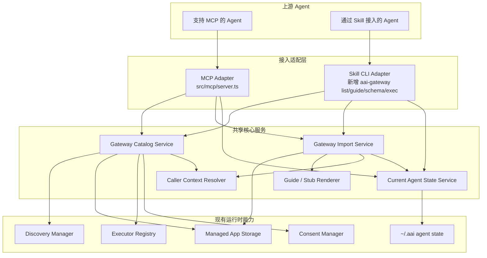

# AAI Gateway 通过 Skill 接入的重构设计

> 版本：v0.7.0-draft  
> 日期：2026-03-28  
> 状态：重写版设计稿  
> 目标：在尽量复用现有架构的前提下，为不支持 MCP 配置的上游 agent 增加 skill 接入方式

## 1. 设计结论

基于当前项目实现和这轮补充约束，结论应收敛为：

1. 披露方式统一为 `summary`，最大 200 字符，不再区分 `keywords` / `exposure`。
2. `agentId` 不能成为 agent 显式传入的业务参数，但 gateway 内部必须能识别当前调用方。
3. 调用方识别不能只用于 `exec`，还必须覆盖 `import`、`disable` 等状态变更操作。
4. MCP 侧不需要 `app:list`，因为标准 `tools/list` 已经覆盖列表能力。
5. Skill 侧需要 CLI adapter，因为 skill 没有协议级 `tools/list`。
6. MCP import 保留二阶段导入。
7. Skill import 改为单阶段导入，直接使用 `SKILL.md` 自带描述生成 `summary`。
8. 通过 skill 接入时，除了 `AAI Gateway` 自身的 access skill，还需要给当前 agent 生成每个 app 的轻量 proxy `SKILL.md`，否则该 agent 无法感知这个 app。
9. AAI Gateway 不负责把 skill 自动复制到其他 agent。skill 导入一定是当前 agent 级别行为。
10. agent-facing 的管理能力收敛到当前 agent 相关的最小集合，不引入跨 agent 发布接口。
11. 现有 `mcp import` / `skill import` / `app config` CLI 可以删除，统一收敛到新的 skill-facing CLI。

## 2. 当前项目真实状态

## 2.1 已有基础能力

当前项目已经具备：

- MCP server：`src/mcp/server.ts`
- discovery：
  - desktop descriptors
  - builtin ACP agents
  - managed imported apps
- executor 抽象：
  - `mcp`
  - `skill`
  - `acp-agent`
  - `cli`
- managed app 存储：
  - imported MCP / skill 都落到 managed apps 目录
  - descriptor 为 `aai.json`

## 2.2 当前 MCP 暴露面

当前 AAI Gateway 对 agent 暴露的 MCP 能力实际上是：

- `tools/list`
  - 返回 `app:<id>` guide tools
  - 返回 gateway tools，例如 `aai:schema`、`aai:exec`、`mcp:import`、`skill:import`、`search:discover`
- `tools/call`
  - `app:<id>`：返回 app guide
  - `aai:schema`：返回 schema
  - `aai:exec`：执行 tool
  - `mcp:import` / `skill:import` / `search:discover`：获取 guide 或执行

所以：

- MCP 侧本来就不需要 `app:list`
- `tools/list` 就是标准 list 入口

## 2.3 当前调用方识别能力

当前代码里，MCP `exec` 已经具备调用方识别能力：

- `src/mcp/server.ts` 在 initialize 后通过 `clientVersion` 记录 `callerIdentity`
- `ConsentManager` 以 caller name 作为授权隔离维度

这说明：

- “调用方识别”不是未来才需要的抽象
- 当前授权模型已经依赖调用方识别

但当前实现还有两个问题：

1. 主要覆盖在 `exec`
2. `import`、CLI 场景还没有统一 caller context

## 2.4 当前 MCP 新增 tool 的自动感知能力

当前 server 端已经有 `tools/listChanged` 通知机制。

导入成功后，`src/mcp/server.ts` 会调用：

- `this.server.sendToolListChanged()`

因此结论是：

- server 端已经支持“新增 tool 后主动通知 client”
- agent 是否真的自动刷新，还取决于具体 client 是否正确实现并消费 `tools/listChanged`

文档里应该把这点写清楚，避免误解成“Gateway 一定能让所有 client 热更新”。

## 2.5 当前 CLI 与 MCP 的关系

当前 MCP 接入路径是：

- 上游 agent 通过 `npx aai-gateway` 启动 MCP server
- 后续交互全部走 MCP transport

所以：

- MCP 接入并不依赖当前 CLI 的 `mcp import` / `skill import` / `app config`
- 这些 CLI 只是本地重复暴露了一部分 importer 能力

因此后续删除旧 CLI 业务命令，不会影响 MCP 接入。

## 2.6 当前 import 行为与目标行为

当前代码里：

- `mcp:import` 是二阶段
- `skill:import` 也是二阶段

但目标设计要改成：

- MCP import：继续二阶段
- Skill import：改单阶段

原因是两者本质不同：

- MCP server 需要先 inspect tools，agent 才能生成准确 summary
- skill 已经有单一入口描述，且 `SKILL.md` 本身有长度约束，没有必要再走一次 inspect -> summary 归纳

## 2.7 当前已有搜索能力

当前 gateway 已经有搜索能力：

- `search:discover`

这个能力在 skill 接入设计里也必须保留，因为真实导入流程通常不是直接从 import 开始，而是：

1. 先搜索
2. 再确认来源
3. 再导入

旧文档没有覆盖这部分，这是缺口。

## 3. 修订后的目标架构

## 3.1 设计原则

1. MCP 对外接口尽量不变。
2. skill 接入复用 MCP 的 app guide / schema / exec 语义。
3. `summary-only`，不再保留 `keywords` / `exposure`。
4. gateway 内部保留 agent 级状态，但 `agentId` 不进入 agent-facing 参数。
5. skill 模式下：
   - `AAI Gateway` 自身工具说明直接写在 access skill 的 `SKILL.md`
   - app 级动态说明通过 `aai-gateway guide --app <id>` 获取
6. 当前 agent 相关管理能力收敛为最小集合：
   - `listAllAaiApps`
   - `disableApp`
   - `enableApp`
   - `removeApp`

## 3.2 总体架构



## 4. 共享核心模型

## 4.1 CallerContext

需要统一 caller context：

```ts
interface CallerContext {
  transport: 'mcp' | 'skill-cli';
  callerId: string;
  callerName: string;
  callerType?: 'codex' | 'claude-code' | 'opencode' | 'unknown';
  skillDir?: string;
}
```

来源如下：

### MCP

- 从 MCP initialize 的 client identity 推断

### Skill CLI

- 从 `AAI Gateway` access skill 的运行上下文推断
- 推荐通过环境变量注入：
  - `AAI_GATEWAY_CALLER_ID`
  - `AAI_GATEWAY_CALLER_NAME`
  - `AAI_GATEWAY_CALLER_TYPE`
  - `AAI_GATEWAY_SKILL_DIR`

注意：

- 这些是 gateway 内部上下文
- 不是 agent 需要构造的业务参数

## 4.2 Agent 私有状态

需要 gateway 自己维护一份 agent 私有状态，用于：

- 记录当前 agent 的 disabled apps
- 记录当前 agent 的 skill 目录
- 记录当前 agent 已生成的 proxy skill

示例：

```json
{
  "agentId": "codex-user",
  "agentType": "codex",
  "skillDir": "/Users/bob/.codex/skills",
  "disabledApps": ["github"],
  "generatedStubs": {
    "skill-git-helper": "/Users/bob/.codex/skills/aai-skill-git-helper/SKILL.md"
  }
}
```

这份状态应放在 gateway 自己的私有目录，而不是 shared data 目录。

推荐路径：

- `~/.aai/agents/<agentId>.json`

原因：

- 这是 AAI Gateway 自己的运行状态
- 不是要给外部工具通用消费的 descriptor 数据

## 5. Skill 文件模型

## 5.1 AAI Gateway 自身的 SKILL.md

`AAI Gateway` access skill 负责告诉 agent：

- 什么时候该用 gateway
- gateway 自己有哪些内置能力
- app 级 guide/schema/exec 怎么走

这份 `SKILL.md` 里应该直接写清楚 gateway 自己的工具说明，而不是再要求 agent 对 gateway tool 先调用 guide tool。

建议结构：

```md
# AAI Gateway

Use this skill when the user wants to search, import, inspect, or use tools managed by AAI Gateway.

## Gateway Built-ins

- Search for MCPs or skills:
  `aai-gateway exec --tool search:discover --args-json '{"request":"git commit skill"}'`
  Parameters:
  `request` is required.
- Import an MCP:
  Inspect:
  `aai-gateway exec --tool mcp:import --args-json '{"command":"npx","args":["-y","@modelcontextprotocol/server-filesystem","/repo"]}'`
  Finalize:
  `aai-gateway exec --tool mcp:import --args-json '{"command":"npx","args":["-y","@modelcontextprotocol/server-filesystem","/repo"],"summary":"Use this MCP for reading and writing files inside /repo.","enableScope":"current"}'`
  MCP import is two-step: inspect first, then finalize with a summary no longer than 200 characters.
  Parameters:
  `command/url/args/env/cwd/headers` follow normal MCP config shape.
  `summary` is only required in finalize.
  `enableScope` must be `current` or `all`.
- Import a skill:
  `aai-gateway exec --tool skill:import --args-json '{"path":"/absolute/path/to/skill","mode":"auto"}'`
  Skill import is one-step. The agent must first download and extract the whole skill directory locally, then pass the local path.
  Parameters:
  `path` is required and must point to a directory containing `SKILL.md` and any companion files.
  `mode` is optional: `manual` means only import into AAI Gateway; `auto` means also copy a proxy skill into the current agent skills directory.
- List all apps for the current agent:
  `aai-gateway exec --tool listAllAaiApps`
- Disable an app:
  `aai-gateway exec --tool disableApp --args-json '{"app":"github"}'`
  Parameters:
  `app` is required and only disables the app for the current agent.
- Re-enable an app:
  `aai-gateway exec --tool enableApp --args-json '{"app":"github"}'`
  Parameters:
  `app` is required and only re-enables the app for the current agent.
- Remove an imported app for all agents:
  `aai-gateway exec --tool removeApp --args-json '{"app":"github","confirm":true}'`
  Parameters:
  `app` is required.
  `confirm` must be `true`, and only after the agent explains the global impact and the user explicitly confirms.

## App Usage

1. Run `aai-gateway list`
2. Run `aai-gateway guide --app <id>`
3. Run `aai-gateway schema --app <id> --tool <tool>`
4. Run `aai-gateway exec --app <id> --tool <tool> --args-json '{...}'`

Examples:
- `aai-gateway guide --app github`
- `aai-gateway schema --app github --tool create_issue`
- `aai-gateway exec --app github --tool create_issue --args-json '{"owner":"openai","repo":"openai-python","title":"Bug report"}'`
```

这份文件由 gateway 维护，内容可以相对完整。

## 5.2 App Proxy SKILL.md

复制到当前 agent skills 目录中的 app proxy `SKILL.md` 应尽量简单。

它只负责两件事：

1. 让 agent 感知这个 app
2. 告诉 agent 去向 gateway 获取实时 guide

示例：

```md
# GitHub via AAI Gateway

Use this skill when the user needs GitHub operations through AAI Gateway.

Do not guess tool names or parameters.
First run:

`aai-gateway guide --app github`

Then follow the live guide returned by AAI Gateway.
```

这样做的好处是：

- agent 能发现该 skill
- 真实 guide 仍由 gateway 统一维护
- app guide 更新时，不需要大规模重写 agent 目录下的完整文件

## 6. 对外接口设计

## 6.1 MCP 暴露面

MCP 暴露面保持最小化：

| 类别 | 名称 | 说明 |
|------|------|------|
| MCP 原生 | `tools/list` | 返回 `app:<id>` 与 gateway tools |
| app guide | `app:<id>` | 返回 app guide |
| gateway tool | `aai:schema` | 获取 schema |
| gateway tool | `aai:exec` | 执行 tool |
| gateway tool | `mcp:import` | MCP 二阶段导入 |
| gateway tool | `skill:import` | skill 单阶段导入 |
| gateway tool | `search:discover` | 搜索候选 MCP / skill |
| gateway tool | `listAllAaiApps` | 列出当前 agent 可管理的所有 app，并标记 disabled 状态 |
| gateway tool | `disableApp` | 仅对当前 agent 禁用 app |
| gateway tool | `enableApp` | 仅对当前 agent 重新启用 app |
| gateway tool | `removeApp` | 从所有 agent 全局移除一个 managed import |

这里要明确：

- MCP 侧不需要 `app:list`
- 也不需要跨 agent 的 publish / unpublish 接口
- `disableApp` / `enableApp` / `removeApp` 是状态管理，不是 app 执行

## 6.2 Skill CLI 暴露面

Skill CLI 是 skill 模式下与 MCP 等价的 transport。

建议新增如下命令：

| 命令 | 说明 |
|------|------|
| `aai-gateway list` | 列出 `app:<id>` 和 gateway tools |
| `aai-gateway guide --app <id>` | 获取 app guide |
| `aai-gateway schema --tool <tool> [--app <id-or-url>]` | 获取 schema |
| `aai-gateway exec --tool <tool> [--app <id-or-url>] [--args-json <json>]` | 执行 tool |

注意：

1. 不再需要 `aai-gateway guide --tool <gateway-tool>`
2. gateway 自身工具说明直接写在 `AAI Gateway` 的 `SKILL.md`
3. 只有 app 级动态说明才需要 `guide --app`

## 6.3 删除旧 CLI 业务接口

建议删除：

- `aai-gateway mcp import`
- `aai-gateway skill import`
- `aai-gateway app config`

保留：

- `aai-gateway` 默认启动 MCP server
- `aai-gateway --scan` 可作为调试命令保留

## 7. 导入与执行流程

这一节要把“搜索 / 导入 / 执行”分开写，不再混在一个时序图里。

## 7.1 搜索流程

无论 MCP 还是 skill，搜索流程都应该先于导入流程：

```text
Agent
  -> search:discover / aai-gateway exec --tool search:discover
  <- 候选 MCP / skill 列表

Agent
  -> 与用户确认来源
  <- 确认导入目标
```

## 7.2 MCP 导入流程

MCP 导入保留二阶段：

### 阶段 1：inspect

- 输入 source config
- 返回工具列表
- 不写 registry

### 阶段 2：finalize

输入：

- source config
- `summary`，最大 200 字符
- `enableScope`

其中 `enableScope` 的用户表达建议为：`生效范围`

可选值：

1. `仅当前应用生效`
2. `所有应用生效`

这对应的是：

- 当前调用方是否立即可见
- 其他应用默认是否可见

## 7.3 Skill 导入流程

Skill 导入改为单阶段：

- 输入 skill path / url
- 读取 `SKILL.md`
- 直接用 skill 自身描述生成 `summary`
- 写入 managed app
- 仅为当前 agent 生成 proxy skill

这里不需要再走 inspect -> finalize，因为 skill 的描述来源已经固定。

但是 skill 导入仍需和用户确认一个选项，建议名称：`接入方式`

可选值：

1. `仅导入到 AAI Gateway`
2. `同时复制到当前 agent 技能目录`

这会影响的是是否为当前 agent 复制 proxy `SKILL.md`，而不是 summary 本身。

注意：

- skill 导入一定是当前 agent 级别行为
- AAI Gateway 不负责把它复制到其他 agent

## 7.4 App 执行流程

执行流程应单独表达：

```text
Agent
  -> aai-gateway list / tools/list
  <- app 列表

Agent
  -> aai-gateway guide --app <id> / app:<id>
  <- app guide

Agent
  -> aai-gateway schema --app <id> --tool <tool> / aai:schema
  <- schema

Agent
  -> aai-gateway exec --app <id> --tool <tool> / aai:exec
  <- result
```

也就是说：

- `guide` 是执行前的说明获取步骤
- 不是导入流程本身

## 8. 当前 agent 的禁用能力

## 8.1 `listAllAaiApps`

作用：

- 返回当前 agent 可管理的所有 app，并附带 disabled 状态

用途：

- 让 agent 能同时看到可用 app 和当前 agent 已禁用的 app

## 8.2 `disableApp`

作用：

- 禁用某个 app

用户可选范围只有一个 agent-facing 行为：

1. `从当前 agent 移除`

## 8.3 `enableApp`

作用：

- 重新启用当前 agent 之前禁用的 app

## 8.4 `removeApp`

作用：

- 从所有 agent 全局移除一个由 AAI Gateway 管理的 imported app

约束：

- 只适用于 managed import，不适用于 desktop / agent / cli 内建发现项
- 执行前必须先由 agent 向用户解释影响，并获得明确确认

更大范围的删除不应放进当前这版 agent-facing 接口。

## 9. 存储设计

## 9.1 Managed app 存储

继续复用现有 managed app 存储：

- managed root：`~/.local/share/aai-gateway/apps`
- 每个 app：`<appId>/aai.json`
- imported skill 内容：`<appId>/skill/...`

这部分是 descriptor / runtime data，放在 share 目录合理。

## 9.2 Agent 私有状态

agent 私有状态改放在：

- `~/.aai/agents/<agentId>.json`

理由：

- 这不是共享 descriptor
- 只是 AAI Gateway 自己的状态配置
- 不需要给其他工具通用读取

## 10. 需要重构的代码点

## 10.1 `src/mcp/server.ts`

目标：从“大一统实现”收敛成 MCP adapter。

需要拆出的内容：

- caller context resolve
- list / guide / schema / exec
- search
- MCP import
- skill import
- disabled apps state

保留在 server 中的内容：

- MCP transport
- `tools/list`
- `tools/call`
- `tools/listChanged`

## 10.2 新增共享 service 层

建议新增：

- `src/core/caller-context.ts`
- `src/core/gateway-catalog-service.ts`
- `src/core/gateway-import-service.ts`
- `src/core/agent-state-service.ts`
- `src/core/stub-renderer.ts`

职责：

- `caller-context`
  - 解析当前调用方
- `gateway-catalog-service`
  - list / guide / schema / exec
- `gateway-import-service`
  - MCP 二阶段导入
  - skill 单阶段导入
- `agent-state-service`
  - listAllAaiApps / disableApp / enableApp / removeApp
  - 当前 agent stub 记录
- `stub-renderer`
  - 生成 `AAI Gateway` 自身 `SKILL.md`
  - 生成 app proxy `SKILL.md`

## 10.3 CLI 重构

`src/cli.ts` 重构为：

### 运行时入口

- 默认启动 MCP server

### Skill adapter 入口

- `list`
- `guide --app`
- `schema`
- `exec`

不再保留旧的 import/config CLI。

## 10.4 热更新通知

导入 MCP 或 skill 后，如果对当前 caller 应该立即可见：

- MCP 侧继续触发 `tools/listChanged`
- skill 侧则通过写入 proxy `SKILL.md` 让当前 agent 在其 skill 体系中可见

这两种“可见性更新”的机制不一样，文档必须区分。

## 11. 分阶段落地

### Phase 1：抽共享 core，统一 caller context

目标：

- 将 `exec`、`import`、`disable` 都接入统一 caller context

### Phase 2：切换到 summary-only

目标：

- 删除 `keywords` / `exposure`
- 所有导入流程只保留 `summary`

### Phase 3：实现 skill-facing CLI

目标：

- 新增 `list/guide/schema/exec`
- 删除旧 CLI import/config

### Phase 4：拆分 MCP / skill 导入流程

目标：

- MCP import 保留二阶段
- skill import 改成单阶段

### Phase 5：生成 access skill 与 app proxy stubs

目标：

- 生成 `AAI Gateway` 自身 `SKILL.md`
- skill 导入后为当前 agent 生成 app proxy `SKILL.md`

## 12. 最终建议

最终方案应收敛为这几点：

1. `summary-only`，不再区分 `keywords` / `exposure`。
2. MCP 导入是二阶段，skill 导入是单阶段。
3. MCP 侧保持 `tools/list + app:<id> + aai:schema + aai:exec` 这套主模型，不新增 `app:list`。
4. skill 侧只提供 `list / guide --app / schema / exec` 四个命令；gateway 自身工具说明直接写进 `AAI Gateway` 的 `SKILL.md`。
5. 调用方识别是必须能力，而且要覆盖 `exec`、`import`、`disable`、`enable`。
6. 当前 agent 相关管理能力收敛为 `listAllAaiApps`、`disableApp`、`enableApp` 和 `removeApp`。
7. agent 私有状态放 `~/.aai`，managed apps 继续放 share 目录。
